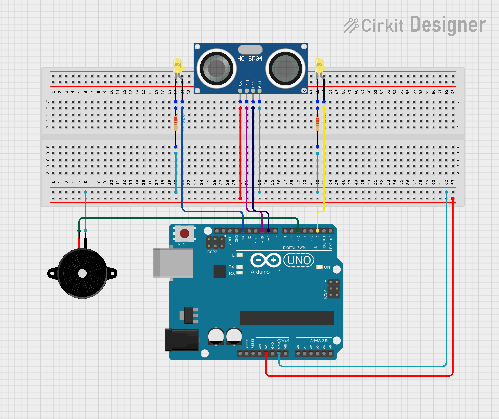

# Arduino Invisible Piano
## Building an invisible Piano using a Ultrassonic Sensor and an Arduino

In this project an Arduino and a Ultrassonic Sensor are used to build a simple piano. 

This is my first hands on project (outside of university) using arduino and the objective is to learn about how an Ultrasonic Sensor works and how its data can be used. For this simple project I follow some guides online in which all the code and schematics is based off.

### Table of Contents

1. [Objective and Algorithm](#1-objective-and-algorithm)
    1. [Defining the frequency of the piano notes](#11-defining-the-frequency-of-the-piano-notes)
    2. [Relating frequency with distance](#12-relating-frequency-with-distance)
2. [Eletrical Circuit](#2-eletrical-circuit)
   1. [Material Needed](#21-material-needed)
   2. [Schematic](#22-schematic)
3. [Code](#3-code)

### 1. Objective and algorithm

The objective is to use the distance data obtained by the sensor to produce sounds at a frequency of a piano note. The further the distance from the sensor, the higher the frequency of the note.

#### 1.1 Defining the frequency of the piano notes

Here is the piano notes we are trying to replicate:

| Note | Frequency (Hz) |
| :- | :-: |
| C5 | 523 |
| D5 | 587 |
| E5 | 659 |
| F5 | 698 |
| G5 | 783 |
| A5 | 880 |
| B5 | 987 |
| C6 | 1046 |

Having the frequency of the sounds we want to reproduce, now we need a way to define when each frequency is going to be played. This is where the Ultrasonic Sensor comes in. 

#### 1.2 Relating frequency with distance

Since this sensor can measure distance, we can set intervals of distance for each note. 
Think of it as simulating each physical piano key, each occupying a bit of space for your finger to correctly press it. In this case, that space is defined not by a physical object, but by an empty space!

Here is the intervals of distance assigned to each note and its corresponding frequency:

| Note | Frequency (Hz) | Interval (cm) |
| :- | :-: | -: |
| C5 | 523 | [ 0, 10 [ |
| D5 | 587 | [ 10, 15 [ |
| E5 | 659 | [ 15, 20 [ |
| F5 | 698 | [ 20, 25 [ |
| G5 | 783 | [ 25, 30 [ |
| A5 | 880 | [ 30, 35 [ |
| B5 | 987 | [ 35, 40 [ |
| C6 | 1046 | [ 40, 45 [ |

The symbol `[` means **including when left** and **excluding when right** to the number.

With the frequency of the notes and the distances to the sensor mapped, we just need some form of speaker to produce sounds accordingly, and with that we have the algorithm of the program defined.

In summary, the algorithm for this piano is:

1. Get the distance from the finger to the ultrasonic sensor;
2. Check in which interval of distance it belongs;
3. Get the corresponding frequency;
4. Make a sound with the chosen frequency;

### 2. Eletrical Circuit

For our piano to work we need to build it!
 
But first we need to gather a few materials.

#### 2.1 Material needed

For this project the components needed are:

| Component | Quantity |
| :- | :-: |
| Arduino Uno | 1 |
| Breadboard | 1 |
| Ultrassonic Sensor HC-SR04 | 1 |
| Yellow LED | 2 |
| Resistor ( ~220 Ohms ) | 2 |
| Piezo | 1 |
| Jumper Wire | 10 |

Note that you can use less of some of the components listed above, this is just an example of how to build this circuit.

#### 2.2 Schematic

The following image shows how to connect all the components listed above:

The piano notes will be played by the piezo, which will receive information about the frequency of the note to play. 
 
That information is obtained by calculating the distance from our fingers to the ultrasonic sensor. For details about how the distance is related to the frequency, go to [Relating frequency with distance](#Relating-frequency-with-distance).
 
As you can see from the schematic and the list of materials, there are two LEDs around the ultrasonic sensor. Those are not essential for the piano to work, but are a nice way of visualizing the moments when the distance is calculated and a piano note is played.

This schematic was designed using the [CirKit Designer](https://www.cirkitstudio.com/download.html).

### 3. Code

In this project we program an [Arduino](https://www.arduino.cc/en/software) to follow this logic. 
 
For details of the code, go to [`src`](./src/). 
 
The [`main.ino`](./src/main/main.ino) file should be uploaded to the Arduino.